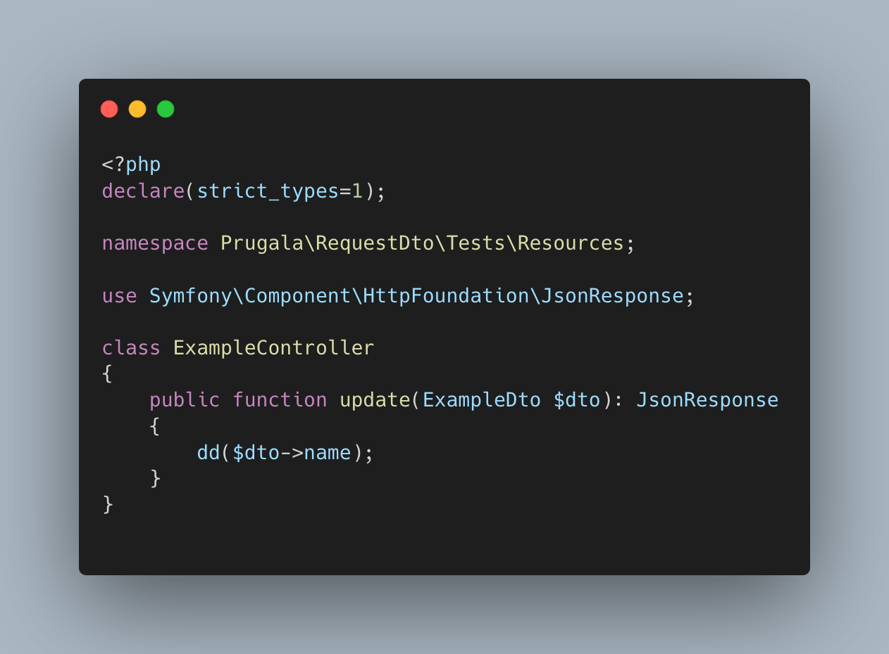
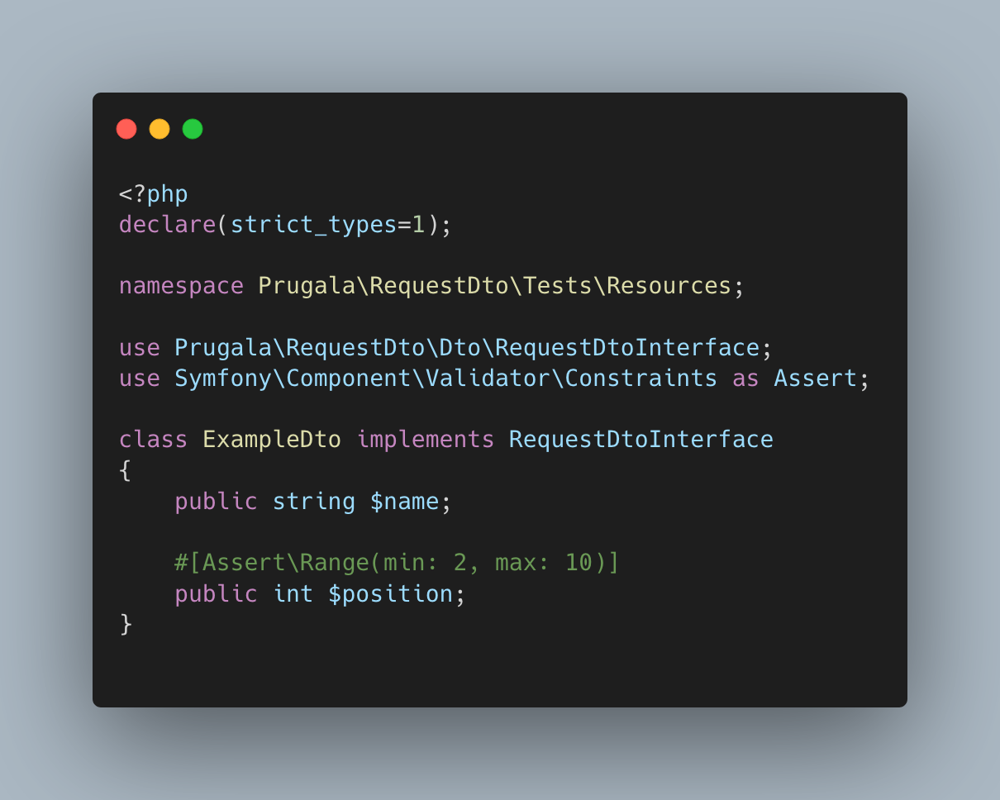
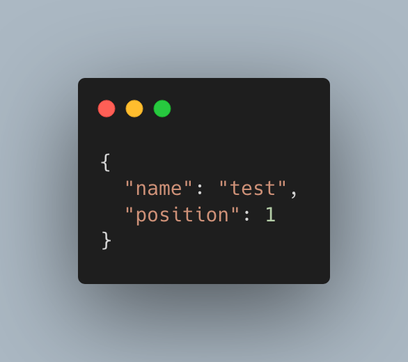
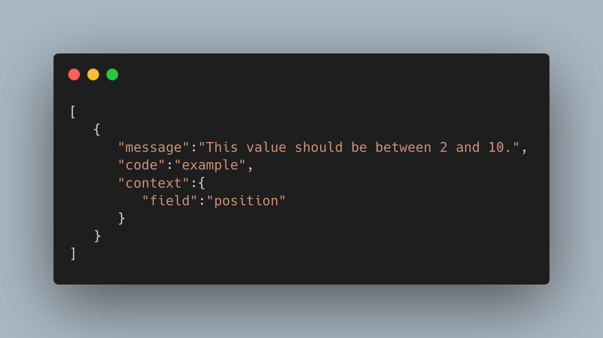

# 


[](https://packagist.org/packages/prugala/symfony-request-dto)
[](https://packagist.org/packages/prugala/symfony-request-dto)
[](https://packagist.org/packages/prugala/symfony-request-dto)
[](https://packagist.org/packages/prugala/symfony-request-dto)

Map request on your DTO object with zero configuration.
## Install

```shell
composer require prugala/symfony-request-dto
```

## Usage

1. Create a DTO that implements the interface `rugala\RequestDto\Dto\RequestDtoInterface`
2. Use your DTO in a Controller e.g.:
   
3. Done, your JSON (other data are on TODO list) will be mapped on your object

### Validation
You can use symfony/validator to validate request.  
If you provide invalid data you will get response 400 with json object with violation list.  

Example:
1. Create DTO with constraint:
   
2. Call your action with JSON object:
   
3. You get response 400 with JSON:
   

If you want to change response format, overwrite method `formatErrors` in listener `Prugala\RequestDto\EventListener\RequestValidationExceptionListener`

## Change log

Please see [CHANGELOG](CHANGELOG.md) for more information on what has changed recently.

## Testing

```shell
composer tests
```

## TODO
- add support for form data
- add support for query data
- add support for upload files

## Contributing

Please see [CONTRIBUTING](.github/CONTRIBUTING.md) for details.

## License

The MIT License (MIT). Please see [License File](LICENSE.md) for more information.
